<div align="center">

# Space Radar

**A living 3D map of everything in motion around Earth — at its real position, right now.**

Satellites, crewed stations, debris, rockets on their way up, probes on their way out,
telescopes at their stations, asteroids and comets on their orbits, and the pads, dishes and
observatories on the ground that talk to them.

[**Open it →**](https://d3hn5yuejgw4ux.cloudfront.net)  ·  soon at **spaceradar.ai**

</div>

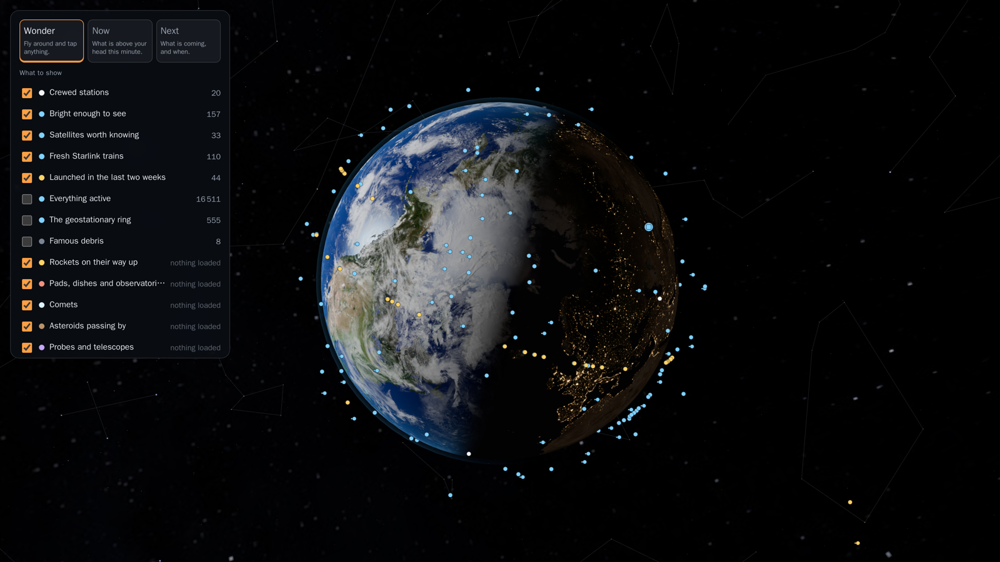

---

## The idea

Every satellite tracker that exists is built for someone who already knows what a TLE is. They are
correct and they are overwhelming. The beautiful ones, meanwhile, are closed and mostly static.

Space Radar is the thing in between: **real positions, computed properly, drawn so that a person
who just got curious understands what they are looking at.** The setting is photographed — real
Earth textures, a true day–night terminator, real star positions. The things that move are drawn,
because a photoreal satellite at that distance is a grey smudge that tells a beginner nothing,
while a friendly one at a *true* position invites the tap.

There are three things you can do, and the interface knows which one you are doing.

| | |
|---|---|
| 🌍 **Wonder** | Fly around and tap anything. What is that dot, and why does it matter? |
| 🔭 **Now** | What is above my head *this minute*, from where I am standing? |
| 🚀 **Next** | Tell me before the next launch, meteor peak or close approach. |

And if you would rather not fly it yourself, there are
**[trips](#trips--the-camera-flies-it-for-you)**: the camera does it, one stop at a time, and
Escape leaves at any moment without moving the view.

---

## What it looks like

<table>
<tr>
<td width="50%">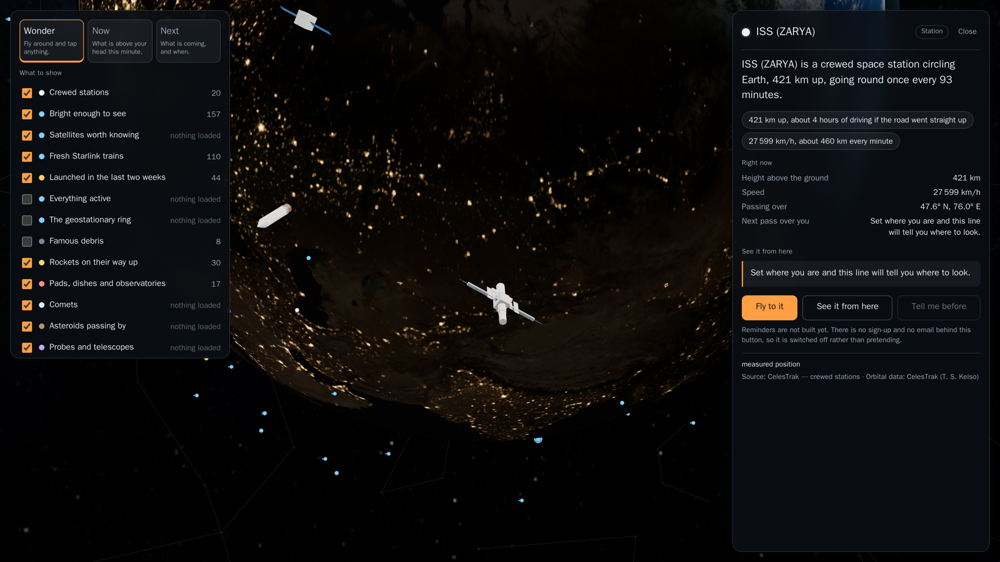<br><b>Tap anything.</b> One plain sentence first, then the numbers you can actually feel — the size of a football field, four hours of driving straight up.</td>
<td width="50%">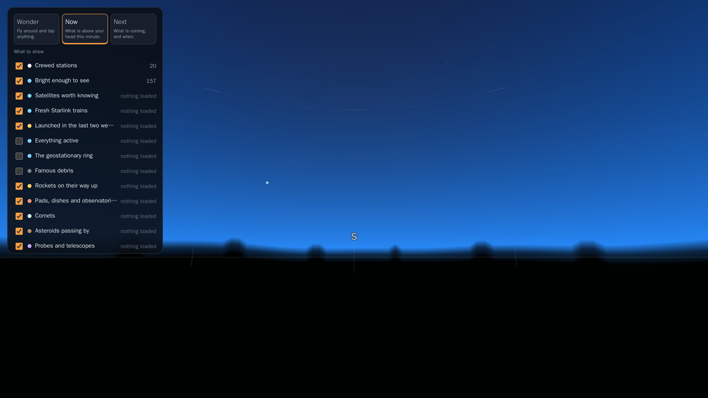<br><b>Look up from where you are.</b> Real stars, real constellations, a horizon, and heights in fists rather than degrees.</td>
</tr>
<tr>
<td width="50%">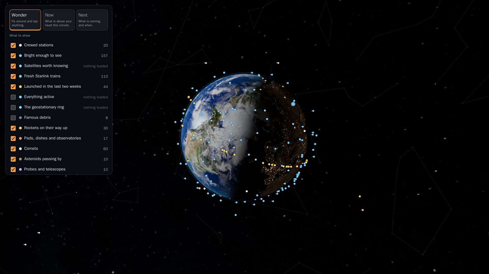<br><b>Switch on everything.</b> Around 16,500 tracked objects, each propagated individually in your browser.</td>
<td width="50%">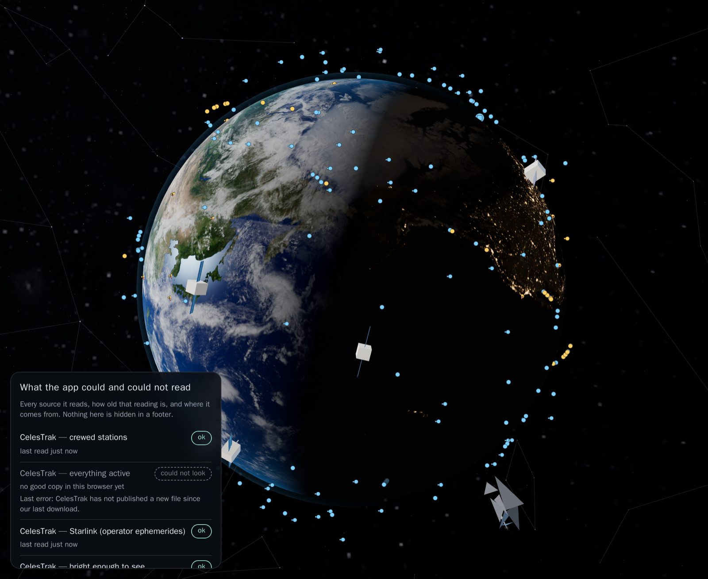<br><b>It tells you what it could not read.</b> Three states, not two — and “could not look” is one of them.</td>
</tr>
</table>

<div align="center">
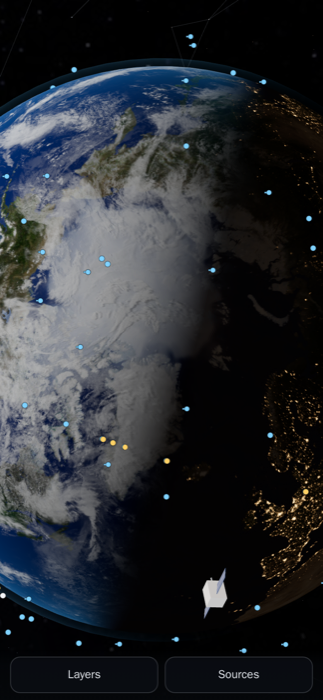<br>
<sub><b>On a phone the sky is the product.</b> Two buttons; everything else is a drawer, and every
drawer closes — from its own Close row, from Escape, or by tapping the sky.</sub>
</div>

---

## Every position says where it came from

This is the rule the whole project is organised around. A friendly drawing of something that is
not really there is the exact failure a map like this must avoid, so nothing on screen is allowed
to be ambiguous about how it was obtained.

- **Measured** — a real position from a real fetch.
- **Propagated** — worked forward from real orbital elements, and the card says how old they are.
- **Illustrative** — a *drawing*. A rocket's ascent arc is always this: the real trajectory is not
  published by anyone, so the arc is shaped from the target orbit and labelled as a drawing.
- **Sample** — bundled demonstration data. Nothing was fetched. Drawn with a dashed halo.

Three object classes are sample data today: asteroids, deep-space probes, and reentries. Not
because it was easier — because NASA JPL's APIs send **no `Access-Control-Allow-Origin` header at
all**, so a browser genuinely cannot call them, and Space-Track needs a login. Fixing that means a
small scheduled job; until then the app says so on the object rather than pretending.

---

## The odd things we sent

Between the satellites and the probes there is a third kind of thing: what went up because
somebody smuggled it aboard, bolted it on, or simply left it where it fell. A family photograph
lying in the dust at Descartes. Two golf balls. Thirty million pages on nickel discs, at the
bottom of a crater a lander made. A gold record eight years past Pluto. A car.

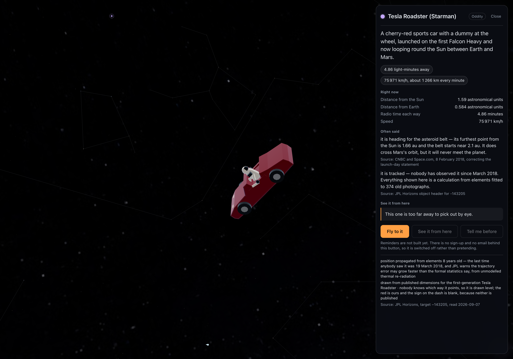

They live in `registry/oddities.yaml`, eight rows, and every row has to say **two separate things
about itself** before it is allowed on the map — because one field cannot say both:

| | |
|---|---|
| **where it is** | `in_orbit` · `on_surface` · `attached` to something the app already draws · `came_home` · `unknown` |
| **how well anyone knows** | `measured` · `inferred` · `illustrative` · `inherit`, which is the carrier's and never better than it |

That split decides everything downstream. **Five get a dot and a model.** **Two are not objects in
space, they are parts of objects in space** — the Voyager Golden Record, and the three aluminium
figures riding Juno — so they are drawn as children of their carrier's model, and a trip that
visits one flies the camera to the carrier, which is where the thing actually is. And **one is
drawn nowhere at all.** Alan Bean's silver astronaut pin is somewhere near the Apollo 12 site in
an unidentified crater and nobody knows which; it gets no propagator, no geometry and no dot. It
is still a record — search finds it, the card opens — and the card says nobody knows. A dot on
this map is a claim, and for that one there is no claim to make.

<table>
<tr>
<td width="45%">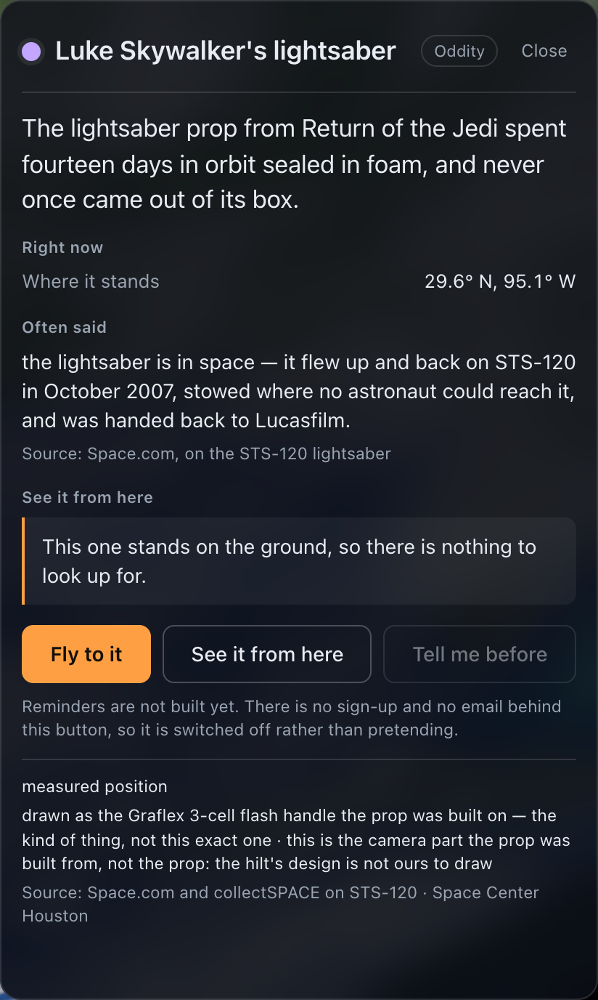<br><b>The one that came home.</b> The <i>Return of the Jedi</i> prop spent fourteen days on STS-120 sealed in foam and never came out of its box, and it stands in Houston now. Every claim on this card says where it came from — including the last one, which admits that what is drawn is a Graflex flash handle: the kind of thing, not this exact one.</td>
<td width="55%">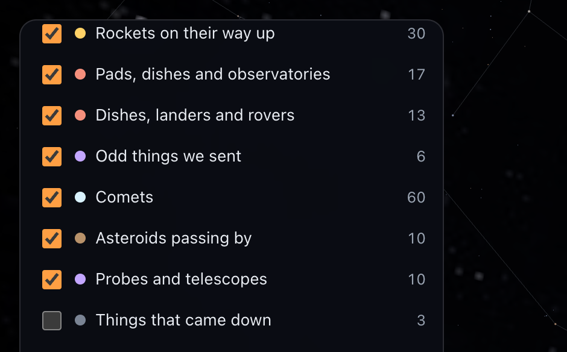<br><b>One row among the others.</b> Adding an odd thing is a row in the registry and nothing at all under <code>site/js/</code>: a generator mirrors the file into the browser copy, and CI refuses a stale mirror.<br><br>They get no tenth colour and no tenth silhouette. They borrow the probe's, because this is not a tenth kind of object — it is a reason for going up.</td>
</tr>
</table>

**“Often said.”** Half of these objects are famous for something that is not true, so the card
has a block for it, and every correction carries the source of the correction. Shepard's second golf
ball did not go 200 yards — the film was measured in 2021 and it went 40. The Roadster is not
heading for the asteroid belt; it crosses Mars's orbit and will never meet the planet. The
tardigrades on the Moon are not living there. It is the most distinctive thing in the app, and it
is one twenty-one-line function in `cards.js`.

**The drawings are drawings, and they say so.** Seven builders, one deliberate detail each: the
fourteen-ray pulsar map on the record cover, the warp in the wrapped photograph, the tardigrade's
rearmost pair of legs pointing backwards the way a real one's do, Starman's elbow out of the
window. Each is measured against a triangle budget written in its own registry row, and each
carries a line on the card naming what the drawing knowingly gets wrong. The pulsar map is two to
three times oversized. The nickel stack is laminated in four bands, not twenty-five. Nobody knows
which way the Roadster points, so it is drawn level, and the red is ours.

---

## Trips — the camera flies it for you

A **trip** is a chain of shots with a card at each one, and the camera flies between them. Three
ship today: *Where people are living in space right now*, *The strangest things we have ever sent*,
which visits the objects above, and *To the edge of what we know*, which leaves the Solar System.

<table>
<tr>
<td width="50%">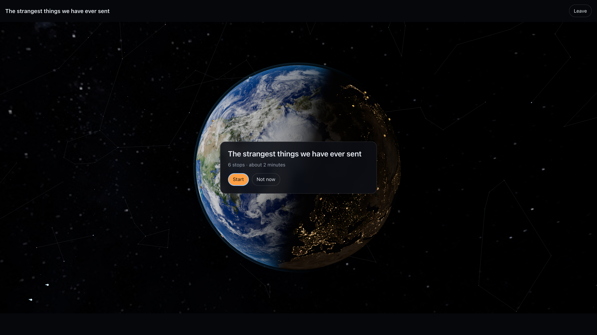<br><b>It tells you the price first.</b> “6 stops · about 2 minutes” is computed from the flights and the dwells by the generator, not typed in by a person — so the number a visitor is promised and the number the browser runs are the same number.</td>
<td width="50%">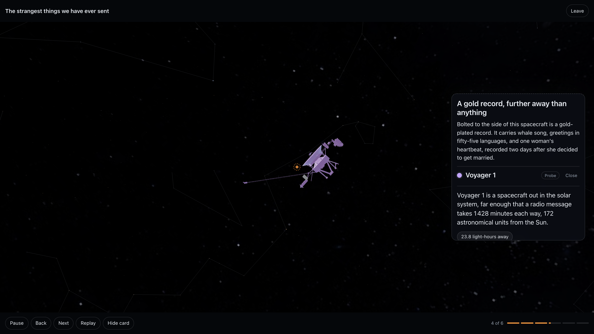<br><b>Everything lives in the letterbox.</b> The controls sit inside the two black bars, so they cost nothing from the picture. This stop's card is about the Golden Record; the camera is at Voyager 1, because that is where the record is.</td>
</tr>
</table>

A still cannot show the part that matters, so: the camera does not simply teleport. For each stop
it searches a hundred and eight standing points and takes one where the subject is actually lit,
times the flight from how far it has to go in log space, arcs out over an apex and back when the
two stops are far apart sideways, and then **keeps drifting while you read** — one signed arc of
up to thirty-four degrees, never a lap. How far it drifts is a number in the stop's own row, and
one stop sets it to zero, because the last shot of that trip wants to be still.

The rule the whole feature is built on is that **a trip may not promise a stop it will not
deliver.** A stop that cannot be found today is dropped *before* the count is shown. A trip that
falls below its own minimum is offered greyed out **with its reason**, never quietly hidden —
a missing feature and a broken one look identical when you hide one.

The other half is that leaving has to be free, or nobody will start:

- **Touching the camera pauses the trip. It never throws you out.** Nudge the view, take your time,
  press Resume and it flies back to the stop it left.
- **Escape leaves immediately, with no confirmation, and the camera does not move** — you keep the
  view you were looking at, and the card stays open on the stop you were on.
- **`prefers-reduced-motion` turns every flight into a cut**, not into a faster flight —
  compressing a four-second sweep into one second makes the trigger worse, not better. It also
  stops the auto-advance, and the reading time comes from the card's own word count, so nothing
  about the camera can shorten it.
- The layers a trip switched on, and the clock speed it clamped, are put back exactly as they were.

Adding a trip is a row in `registry/tours.yaml` and a row per stop, and nothing under `site/js/`.
Twenty-one refusals guard that file; the one that forbids a trip id from colliding with a layer id
caught a real collision the first time it ran.

---

## Beyond the Solar System — the scale ladder

Near the Earth one scene unit is a thousand kilometres, which is right for a satellite and useless
for a star: Proxima Centauri would be forty billion units away, past what a GPU can hold. So the
map has **rungs**: stages where one unit is a light-year, a kiloparsec, or a million light-years,
centred on the Sun. Select a star, a nebula or a black hole and the map climbs to the rung it lives
on; the sky-sphere you see from Earth — which is only true from inside the Solar System — fades out,
and the same stars come back as places.

What is out there, and where every number came from:

- **109 389 stars** with a measured distance, from the HYG Stellar Database (Gaia and Hipparcos),
  sized on the GPU by how bright they would look from wherever the camera is. The 10 224 stars whose
  distance nobody has measured are counted and **not drawn** on an invented shell.
- **Every confirmed planet around another star** (6 332 as of the catalogue copy's date), from the
  NASA Exoplanet Archive, drawn *at its star* — the orbit is far below a pixel at any zoom — with
  its size and mass in Earths, its year, and how it was found.
- **The 110 Messier objects and the Large Magellanic Cloud** at sourced distances. OpenNGC has
  positions for 13 372 deep-sky objects and no distances, so the other 13 261 are not placed as
  places, and the file says so.
- **The Milky Way** as a point cloud built from published measurements — Reid et al. 2019's fitted
  spiral arms and the distance to the centre, the disc's measured size, the debated bar at the
  middle of its range — and called an *illustration* everywhere it appears. Nobody has seen our
  galaxy from outside.
- **Fourteen extremes** — black holes, pulsars, a magnetar, Eta Carinae and Betelgeuse — with a fact sheet each: position, distance, mass or spin exactly
  as the source prints them, and the page it was read from, on the card.

Picking is fair to the small thing: a tap scores by distance to an object's *edge*, and the smaller
thing wins when both are within reach — a satellite drawn over Earth is what the finger means. A
long press on a crowded spot lists what is under it. Planets are objects like everything else:
searchable (*Luna*, *the Red Planet*), listed with a count, tappable, with a card that says how much
nearer than true they are drawn and offers to make them the centre of the map.

Under the layers, **How far** is a breadcrumb — Moon, Sun, Neptune, Proxima, the Pleiades, the
galactic centre, Andromeda, M87's black hole — and under it the honesty line: how much of the known
sky this map draws, with sources.

---

## Finishing the front end — what the studies taught

Three competitors were studied (satellitemap.space, orbitalradar.com, satellitetracker3d.com) and the
best of each was taken, as data where a registry could hold it:

- **Colour by** — one click recolours every dot by a fact it already carries: height, orbit tilt, or
  how long it has been up, from `registry/colorkeys.yaml`; the legend counts the dots on screen and
  says how many have no value rather than guessing one.
- **Sunlit or in shadow** — every Earth-orbiting dot dims when it is in Earth's shadow, and its card
  says which; a shadow-cylinder test in scene units, ten times a second, for the whole sky.
- **The orbit line** — select anything that laps and one closed lap is drawn from the same elements as
  the dot; the card says so. **The trajectory chart** on the card shows height and the ground track
  over the next lap and a half, broken at the date line.
- **Trains** — a fresh launch's satellites are one thing: who leads (by orbital phase), whether it is
  still climbing as a line (a registry threshold), and when the line comes over you.
- **Provisional objects** — a launch the public catalogue has not numbered yet is drawn dimmer, classed
  *inferred* whatever its elements' age, and its card says where the number will come from.
- **Space weather** — one line at the top of the status panel: NOAA's Kp, the word it means, how old the
  reading is by NOAA's own stamp, and whether it was read live or from our copy.
- **Data-saver and a frame-rate latch** — on a slow or metered connection the two heavy catalogues wait
  until asked for; when frames stay slow for three seconds the picture drops to one pixel per pixel
  without the Milky Way backdrop — once, and said in the panel.
- **Labels, the Next list, search to its spec** — names over the selection, its train and the nearest
  notable things (never the catalogue); a Next moment that lists launches, close approaches, perihelia
  and passes from what is already loaded; eight search rows with whole words first, an announced
  fallback, and nicknames as a registry.

---

## Nine silhouettes, learned once

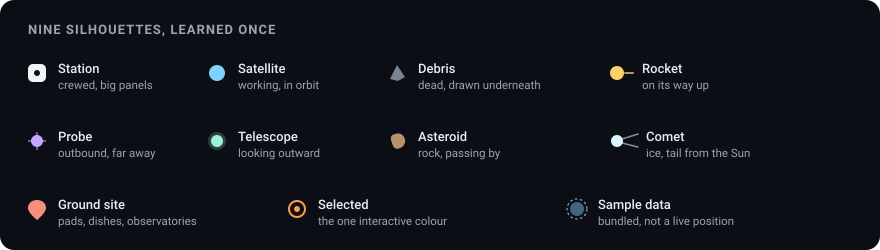

Size on screen encodes *class*, never true size — at true scale every one of these is invisible.
The real size lives on the card as something you can picture instead.

**Rockets are the exception, and they are drawn per family.** Every launch used to be the same
white tube. `registry/rockets.yaml` now holds **forty-nine launch vehicles**, and four fields carry
the recognition at forty pixels: the shape of the strap-ons, what sits on top, the nozzle pattern,
and the taper of the body. A number nobody could source is not written down — the field is left
out and the builder falls back to a class-typical proportion, or the row is omitted entirely and
the launch falls through to the generic rocket, which the card says out loud. **Thirty-four of the
forty-nine have no documented livery**, because colour lives in photography and not in
specifications; those rows draw in the neutral default and their cards say nothing at all about
colour. Two widely repeated colour claims that no source supports are called out in the rows that
would have carried them.

---

## How it works

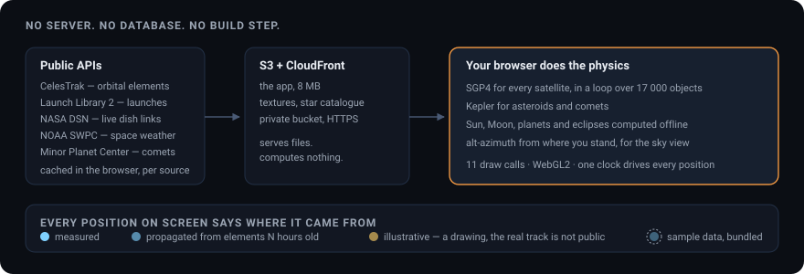

There is **no server, no database and no build step.** The browser fetches a handful of public
APIs, caches them, and does the orbital mechanics itself:

- **SGP4** for every object in Earth orbit, the same model the catalogues are published for.
- **Kepler** propagation from published elements for asteroids and comets.
- **Sun, Moon, planets, eclipses and twilight** computed offline by an ephemeris library — no
  network call at all for the most-used part of the app.
- **Alt-azimuth** from your position for the sky view, including whether a satellite is sunlit
  while you are in darkness, which is what decides if you can actually see it.

Measured on the live site: **17 555 objects, 11 draw calls, WebGL2, device pixel ratio clamped to
2.** The whole scene is a handful of instanced meshes.

### Try it in thirty seconds

```bash
git clone https://github.com/Sara-Managed-Projects/space-radar.git
cd space-radar
python3 -m http.server 8177 --directory site
```

Then open <http://127.0.0.1:8177>. That is the entire toolchain. `site/` is what gets served, byte
for byte — there is nothing to compile.

### Put it on your own bucket

```bash
./scripts/provision.sh --bucket your-unique-bucket-name
./scripts/deploy.sh    --bucket your-unique-bucket-name --distribution E1ABCDEF23456
```

`provision.sh` makes a **private** S3 bucket, an origin access control, and a CloudFront
distribution whose ARN is the only thing the bucket policy admits. HTTPS matters here beyond good
manners: geolocation and device orientation only work in a secure context, so a plain HTTP bucket
cannot run the sky view. Both scripts take `--dry-run`.

### Your own domain

```bash
# 1. the certificate MUST be in us-east-1, whatever region the bucket is in
aws acm request-certificate --region us-east-1 \
  --domain-name example.com --subject-alternative-names www.example.com \
  --validation-method DNS

# 2. add the CNAME records it asks for at your DNS host, wait for ISSUED, then:
./scripts/attach-domain.sh --distribution E1ABCDEF23456 \
  --domain example.com --domain www.example.com
```

The script refuses to run against a certificate that is not yet issued, and against a name the
certificate does not cover — both of which otherwise fail deep inside CloudFront with an unhelpful
message.

**The apex catches everyone once.** A bare domain cannot be a CNAME, and CloudFront has no fixed
IP for an A record. Either use Route 53 (an ALIAS record at the apex), a DNS host that flattens
CNAMEs, or forward the apex to `www` and point `www` at the distribution. The script prints the
right instruction for whichever names you attached.

---

## What is in the repository

```
site/                 the entire app, served as-is
  index.html          the shell; reports a failed boot in words, never a black screen
  js/propagate/       frames and the six propagators, one signature between them
  js/data/            fetching, caching, parsing, and the bundled sample data
  js/scene/           renderer, stage, worlds, Earth shader, starfield, glyphs, models
  js/sky/             pass prediction and the ground-up view
  js/ui/              cards, controls, the sources panel, the phone drawers, the trip, and the
                      GitHub link in the corner
  vendor/             three.js, satellite.js, astronomy-engine
  models/             twenty-nine NASA models, loaded one at a time when you get close
  textures/ data/     planet textures and the star catalogue
registry/             eleven YAML files. Adding a world, an object class, a data source, an event
                      type, a launch vehicle, an odd thing or a whole trip is a ROW here — not a
                      code change. CI enforces it, and refuses a stale generated mirror.
scripts/              provision, deploy, the validator, the three mirror generators, and the
                      README screenshot script
tests/                registry validation, the module contract, a growth test, and a refusal test
                      that breaks every rule on purpose to prove the validator still says no
```

**The registry is the architecture.** `tests/test_growth.py` adds Europa — a moon two levels down
the world tree, so its frame has to compose through Jupiter — and proves it is five registry rows
and nothing under `site/js/`. If that test ever fails, the architecture regressed, whatever the
feature that caused it.

---

## The stack

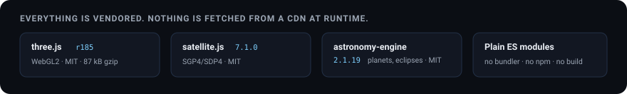

| | |
|---|---|
| **Rendering** | [three.js](https://threejs.org) r185, WebGL2, logarithmic depth buffer, instanced glyphs |
| **Orbital mechanics** | [satellite.js](https://github.com/shashwatak/satellite-js) 7.1.0 — SGP4/SDP4 |
| **Astronomy** | [astronomy-engine](https://github.com/cosinekitty/astronomy) 2.1.19 — planets, eclipses, rise and set |
| **Language** | Plain ES modules. No bundler, no npm at runtime, no framework, no CDN. |
| **Hosting** | S3 behind CloudFront. Private bucket, origin access control, HTTPS. |
| **CI** | GitHub Actions — registry validation, the module contract, and screenshots of the real app |

Everything is vendored into `site/vendor/`. Nothing is fetched from a third-party CDN at runtime,
and the only outbound call the page makes to anyone but its own origin is an optional cloud-cover
forecast for the sky view.

---

## Where the data comes from

Everything here is public, free, and used within its stated terms. **[CREDITS.md](CREDITS.md)** has
the full list with licence texts and required attribution lines.

| Source | What it gives | Attribution |
|---|---|---|
| [CelesTrak](https://celestrak.org) | orbital elements for everything in Earth orbit | Orbital data: CelesTrak (T. S. Kelso) |
| [The Space Devs](https://thespacedevs.com) | launches, pads, agencies, missions | Launch data by The Space Devs |
| [NASA Deep Space Network](https://eyes.nasa.gov/dsn/) | which dish is talking to which spacecraft, live | NASA/JPL |
| [NOAA SWPC](https://services.swpc.noaa.gov) | geomagnetic activity and the aurora oval | NOAA Space Weather Prediction Center |
| [Minor Planet Center](https://minorplanetcenter.net) | comet orbital elements | IAU Minor Planet Center |
| [Solar System Scope](https://www.solarsystemscope.com/textures/) | planet and Milky Way textures | CC BY 4.0 |
| [d3-celestial](https://github.com/ofrohn/d3-celestial) | star catalogue and constellation lines | Olaf Frohn, BSD-3-Clause |
| [HYG Stellar Database](https://codeberg.org/astronexus/hyg) | 119 614 stars with distances, names, colours (v4.4) | David Nash, CC BY-SA 4.0 |
| [NASA Exoplanet Archive](https://exoplanetarchive.ipac.caltech.edu) | every confirmed exoplanet (pscomppars) | Caltech/IPAC for NASA, DOI 10.26133/NEA13 |
| [OpenNGC](https://github.com/mattiaverga/OpenNGC) | positions, types and sizes of the Messier objects | Mattia Verga, CC BY-SA 4.0 |
| Wikipedia | Messier distances; the Magellanic Clouds; black-hole and pulsar fact sheets | facts, each row cites its page |
| Reid et al. 2019, ApJ 885:131 | the Milky Way's spiral arms and the distance to its centre | the illustrative galaxy model |

**If you fork this, read CelesTrak's usage policy.** It allows one download per file per two hours
and firewalls clients that retry a rejection. The app already honours it with a per-source cache;
please do not remove that.

---

## Contributing

Issues and pull requests are welcome. The things most worth doing, roughly in order:

1. **The scheduled harvester.** Move the API calls out of the browser into a small cron job that
   writes JSON snapshots. It is what turns the three `sample` classes into live ones, and it is the
   single biggest improvement available.
2. **More real 3D models.** Twenty-nine ship, from NASA's public-domain library, and they cover the
   famous objects. Everything else is still procedural geometry and reads as its class rather than
   as that particular spacecraft.
3. **More trips.** Two ship. The registry supports four target forms; `group:` (frame several
   objects at once) and `view:` (“the next time it crosses your sky”) are designed and not built,
   and each of them unlocks a trip that wants it.
4. **Frame rate on real phones.** The budgets in the code are targets, not measurements. Numbers
   from an actual mid-range Android would be genuinely useful.
5. **Copy.** Every card should be readable by a curious twelve-year-old. Some are not yet.

Before opening a PR, run what CI runs:

```bash
python3 scripts/check_registry.py        # the eleven registries validate
python3 scripts/gen_rockets_js.py --check   # the browser's copy of the registry is current
python3 scripts/gen_oddities_js.py --check  #   "
python3 scripts/gen_tours_js.py --check     #   "
python3 scripts/check_copy.py            # no user-visible string outside copy/en.js
python3 tests/test_growth.py             # adding a world is still just a registry row
python3 tests/test_refusals.py           # the validator still refuses what it claims to
node     tests/test_contract.mjs         # imports resolve, and every drawn shape fits its budget
```

Screenshots for this file come from the real app, in a browser, against live data:

```bash
python3 -m http.server 8177 --directory site &
node scripts/shots.mjs --base=http://127.0.0.1:8177 --out=assets/readme
#   --only=trip,oddities   to retake one or two rather than all of them
```

---

## Licence

The project's own code is [MIT](LICENSE). Vendored libraries, textures and catalogues keep their
own licences — all of them are listed in [CREDITS.md](CREDITS.md), and all of them permit this use.

One thing in the page is neither ours nor licensed to us: the **GitHub mark** in the top corner is
GitHub's trademark, drawn from GitHub's own published file, **unmodified**, because that is the
condition on which their brand guidelines allow it to link to GitHub. `CREDITS.md` §4.6 says where
it came from and how that was checked, and `scripts/check_registry.py` refuses a `marks` row that
claims the glyph was changed.

<div align="center">
<sub>Built with real orbital mechanics and a lot of respect for the people who publish the data for free.</sub>
</div>
