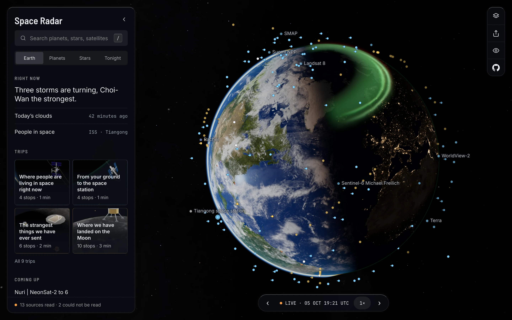
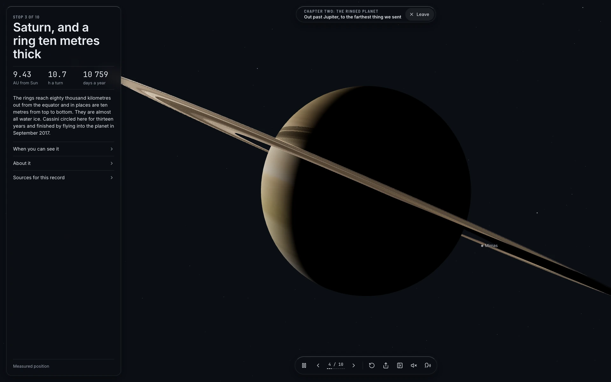
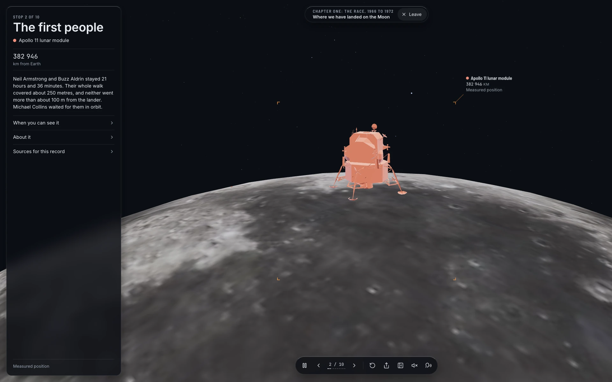
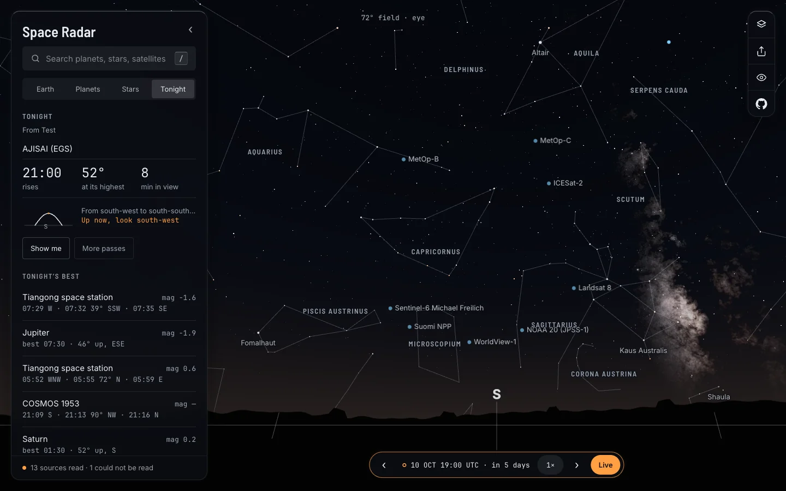
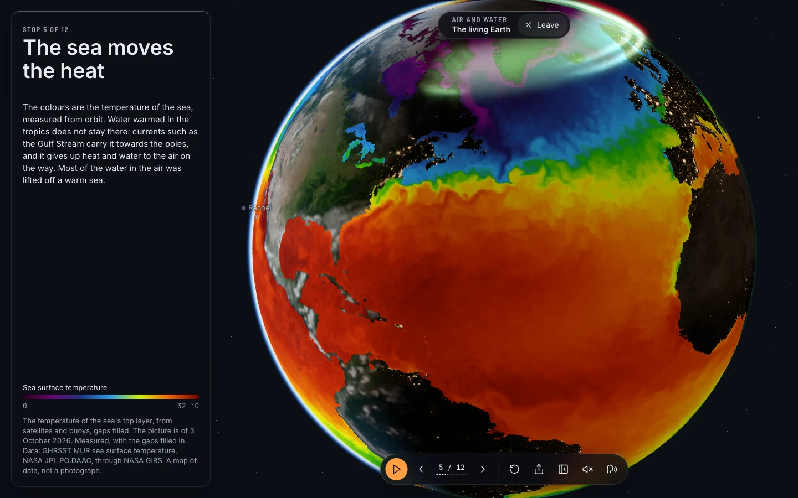
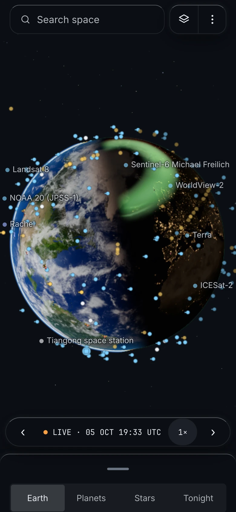

<div align="center">

# Space Radar

**A free, open planetarium in your browser.**<br>
Every satellite at its real position right now, the planets and their moons, 109 389 stars,
and 26 narrated trips that fly you there.

### [Open it: www.spaceradar.ai](https://www.spaceradar.ai)

[](https://github.com/Sara-Managed-Projects/space-radar/actions/workflows/ci.yml)
[](LICENSE)
[](#run-it-locally)
[](docs/RUN_LOCALLY.md)
[](https://www.spaceradar.ai)
[](https://github.com/Sara-Managed-Projects/space-radar/labels/good%20first%20issue)

[](https://www.spaceradar.ai)

</div>

## What it is

Space Radar is a living 3D map of space. It draws the Earth with today's clouds, about 17 000
satellites where they are this minute, the space stations and who is aboard, rockets about to
launch, probes on their way out, every planet and 21 moons (20 of them with a real map), the stars
in three dimensions, nebulae as telescopes photographed them, and the Milky Way from outside. Step
down to the ground and it is tonight's sky from your own street. Twenty-six guided trips, read
aloud, fly the camera for you; forty nearby star systems have a stage you can fly into. It is a static website: the physics runs in your browser, on public
data, and every number on screen says where it came from.

## Why

- **Learning about space should be free and simple.** No account, no adverts, no tracking, no
  install. Open a link and you are looking at the sky as it is now.
- **It should run anywhere.** A school, a university, a kindergarten or a village library can
  [run its own copy](docs/RUN_LOCALLY.md), on an old laptop, with no internet at all.
- **It should be honest.** Everything drawn is measured, modelled or illustrative, and says which.
- **It is built in the open, in the AI era.** Much of this project was written by people working
  with AI assistants, held to account by tests and by sources. That makes it a good time to join
  in: an idea, a correction or a fix from you can be on the live site within days.
  **Issues, fixes and ideas are all welcome.**

## What you can do with it

| | |
|---|---|
|  |  |
| **Take a guided trip.** Tonight from your street, why the Moon changes shape, the life of a star, black holes, back to the Moon with Artemis. 26 trips and 205 stops, with about 65 minutes of narration, captions and music. | **Stand where we have been.** Twenty places on the Moon and eleven on Mars that spacecraft reached, each on its own ground, with the facts and their sources on the card. |
|  |  |
| **Look up from your own street.** The sky from the ground: figures, grids, tonight's best passes and planets, a city, town or dark sky, and a red night mode. | **Read the living Earth.** Seven maps of data measured from orbit, from NASA: sea temperature, sea ice, rain, plant life and more, each with its key and its source. |



- **Follow anything in orbit.** The ISS, Hubble, Starlink trains, debris: where it is, how fast,
  whether it is in sunlight, and when it passes over you.
- **See the deep sky.** Real photographs of 27 nebulae and galaxies in their true places, with an
  exposure control, and the whole sky in other light: infrared, microwaves, gamma rays.
- **Go anywhere, at any time.** Fly from a rooftop to the edge of the Milky Way; drag the time
  scrubber to the next eclipse; follow eight missions along their own timelines.
- **Teach with it.** Present mode sets a trip's words large for a room and waits for your
  clicker. After one visit it works offline, and it installs like an app.
- **Put it in your page.** One live object or one trip as an
  [embed](docs/EMBEDDING.md), with no tracker and no cookie.
- **Use it on a phone.** The same map, one sheet, one thumb.

Also: live clouds, storms, lightning and the aurora on the Earth · close-up map tiles of the Earth,
the Moon and Mars · today's sunspot groups · eclipses computed for any date · 70 spacecraft and
shape models · fires, volcanoes and icebergs from NASA's EONET and the wind from NOAA's GFS ·
"Point your phone" at the sky · a passport of places opened and one true sentence on the home ·
reels that play on their own on a screen in a lobby (spec 0036) · artist's impressions, labelled
so, of planets nobody has seen · shareable links, postcards and a photo mode · full keyboard control.

### Links

The address bar is the view: what is selected, the moment on the clock, the map and the trip stop
are all in it, so copying it is sharing what you see. A trip has two link forms. `/t/<trip>.html`
is a small page of its own with the trip's picture and words, the one to paste into a chat or a
post so it unfurls; it opens the app at the trip. `#trip=<trip>&stop=<n>` is the app itself at
that stop, the one the address bar shows while you fly. Moving through a trip does not add to the
browser's history: Back is not "previous stop", it leaves the trip for the page you came from (the
trip has its own Previous). Back and Forward between two links you opened put the whole view back
each time: the selection, the clock, the map and the stop.

## Run it locally

```bash
git clone https://github.com/Sara-Managed-Projects/space-radar.git
cd space-radar
python3 -m http.server 8177 --directory site      # then open http://localhost:8177
```

That is the whole toolchain: there is nothing to install or compile. For Windows, classrooms,
a school server, a USB stick, and **running with no internet**, see
**[docs/RUN_LOCALLY.md](docs/RUN_LOCALLY.md)**. Each [release](https://github.com/Sara-Managed-Projects/space-radar/releases)
is a zip that already contains a saved copy of the data and starts offline.

## How it is built

```
site/        the whole app, served as it is: plain ES modules, three.js, no bundler, no framework
registry/    YAML files that say what exists: worlds, layers, data sources, trips, models, budgets
scripts/     generators that turn a registry into the JavaScript the browser reads, and the checks
tests/       130 node and python test files; no browser needed
harvest/     a small scheduled job that saves each public data source for the site to read
docs/        running it, embedding it, design principles, releasing
```

Adding a moon, a landing site, a search alias or a whole trip is a **row in a registry**, not a
code change, and CI holds the project to that. Satellites move by SGP4, asteroids and comets by
Kepler's equation, the Sun, Moon and planets by an ephemeris library, all in the browser.

## Contributing

It is meant to be easy and fun. **[CONTRIBUTING.md](CONTRIBUTING.md)** has a ten-minute first
contribution, recipes for adding a trip, an object or a layer, and one command that runs every
check (`scripts/test.sh`).

- Start with a [good first issue](https://github.com/Sara-Managed-Projects/space-radar/labels/good%20first%20issue),
  or something marked [help wanted](https://github.com/Sara-Managed-Projects/space-radar/labels/help%20wanted).
- Found a wrong number or a wrong name? A [data-accuracy report](https://github.com/Sara-Managed-Projects/space-radar/issues/new?template=data-accuracy.yml)
  with a source is gold.
- Have an idea, or teach with it? [Tell us](https://github.com/Sara-Managed-Projects/space-radar/issues/new/choose).
- Please read the [Code of Conduct](CODE_OF_CONDUCT.md). Security reports go through
  [SECURITY.md](SECURITY.md); other help is in [SUPPORT.md](SUPPORT.md).

Releases come out about monthly; see the [changelog](CHANGELOG.md) and
[how we release](docs/RELEASING.md).

## Data and credits

Space Radar stands on data and work that other people publish for free. Thank you.

**Data and APIs**

[](https://celestrak.org)
[](https://ssd.jpl.nasa.gov)
[](https://thespacedevs.com/llapi)
[](https://nasa-gibs.github.io/gibs-api-docs/)
[](https://trek.nasa.gov)
[](https://www.swpc.noaa.gov)
[](https://nowcoast.noaa.gov)
[](https://www.gdacs.org)
[](https://exoplanetarchive.ipac.caltech.edu)
[](https://eyes.nasa.gov/dsn/)
[](https://neo.ssa.esa.int)
[](https://www.wikidata.org)
[](http://open-notify.org)

**Catalogues, maps, models and pictures**

[](https://codeberg.org/astronexus/hyg)
[](https://github.com/mattiaverga/OpenNGC)
[](https://github.com/nasa/NASA-3D-Resources)
[](https://www.solarsystemscope.com/textures/)
[](https://www.naturalearthdata.com)
[](CREDITS.md#3h-the-sky-in-other-light--nasas-wise-wmap-and-fermi-through-cds-hips)
[](CREDITS.md)

**Code, type and sound**

[](https://threejs.org)
[](https://github.com/shashwatak/satellite-js)
[](https://github.com/cosinekitty/astronomy)
[](https://lucide.dev)
[](CREDITS.md#10-fonts)
[-2da44e)](CREDITS.md#9-audio--music-and-sounds)
[-2da44e)](CREDITS.md#9b-audio--the-trips-narration-a-synthetic-voice)

**[CREDITS.md](CREDITS.md)** has every one of them with its licence, its required credit line and
what we changed. None of these organisations endorses Space Radar.

> **Forking it?** Read [CelesTrak's usage policy](CREDITS.md#41-celestrak--read-this-before-you-deploy-a-fork)
> first: one download per file per two hours. The app's cache honours it; please keep that.

## Licence

- **The code** (everything we wrote: `site/js`, `site/css`, `scripts`, `tests`, `harvest`, `tools`,
  the registries and these documents) is **[MIT](LICENSE)**.
- **Data and assets keep their owners' licences**: vendored libraries (MIT, ISC, BSD), planet maps
  (CC BY 4.0 and public domain), star catalogues (CC BY-SA 4.0, BSD), photographs (CC BY 4.0), the other-light sky tiles (ODbL 1.0),
  the constellation pictures (Free Art License 1.3, copyleft: `site/data/skyart/LICENSE.txt`), other peoples' sky figures (CC BY-SA 4.0),
  NASA models (public domain), fonts (SIL OFL 1.1), music (CC0). Data fetched live or saved under
  `site/data/v1/` belongs to its publisher under the publisher's terms. [CREDITS.md](CREDITS.md)
  is the full list, including the few terms we have not been able to confirm.
- The GitHub mark in the app is GitHub's trademark, used unmodified under GitHub's logo rules.

<div align="center">
<sub>Built with real orbital mechanics and a lot of respect for the people who publish the data for free.</sub>
</div>
